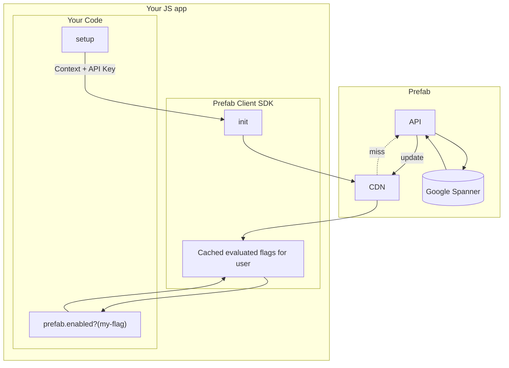

import Tabs from '@theme/Tabs';
import TabItem from '@theme/TabItem';

## Client Architecture

The client architecture has different goals and different operating characteristics from the server side SDKs. The goals of the clients are:

1. Make lookups as fast as possible
2. Don't leak raw configuration data to the end user
3. Give clear and configurable behavior options if a connection cannot be made

With those goals in mind, the architecture is:



Clients will make a single request and receive the values of all evaluated Feature Flags for a given context.

Multiple requests only happen if you change the attributes of a context and re-initialize the client.

Note that **evaluation happens server side**  . This helps prevent potentially sensitive data from leaking out of your system.
The client will be returned a list that is basically:
```json
{
  "feature.exp12-big-button":  "control",
  "feature.exp14-button-class":  "very-blue",
  "feature.risky-business":  true
}
```

See [server SDKs](/docs/explanations/server-sdks.md) to compare.

## Client Side Reliability

Each end-user that needs flags evaluated is a different request to Prefab. So what happens if Prefab goes down?

First the good news. All active users will be unaffected, because they will have cached values in the CDN.
If you make a change to your feature flags, it won't be reflected, but in general logged-in users will have a consistent
experience.

The less good news. Evaluation happens server side, so if we don't have a server we won't have values. Without values, your `isEnabled` checks will return `false`.

The default timeout is `10 sec`, but you can set this in client initialization.
