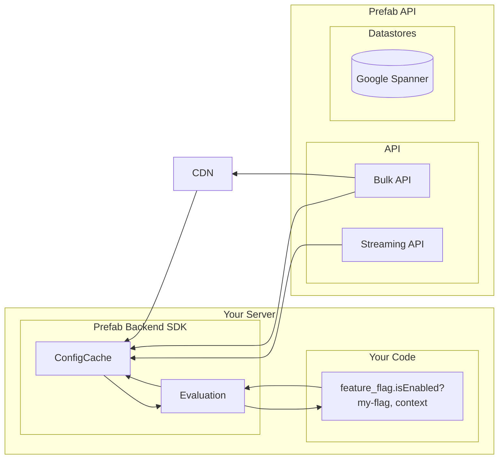

## SDK Architecture

The Prefab server-side SDKs are all built with the following 3 goals in mind:

1. Very fast lookups that do not require any remote calls.
2. Being highly resilient in the case of outages
3. Near instant updates when changes are made

The architecture to do this looks like this:

Your code will instantiate a singleton of a Prefab Client. This client starts will fetch the latest configuration, trying
multiple sources in case of errors. Once it gets a connection it will unlock and be available for your code.

The client will also start a streaming connection to the APIs to pull down new changes.

Additionally, the SDK will poll for updates as a resiliency measure.

Note that the evaluation is always happening in-process in your application.
Feature flags and config are stored in process so are lightning fast (no API calls when you access them).

[See Frontend SDKs to compare](/docs/explanations/concepts/frontend-sdks.md)

## Implementation

When your client boots, it creates a local thread safe hashmap which will hold the config.
The general purpose Prefab config system will then push & pull changes down to your clients.
The expected latency is < 100 ms.

Feature flags are built on top of the Prefab config store so all reliability notes are applicable for Feature Flags as well.
