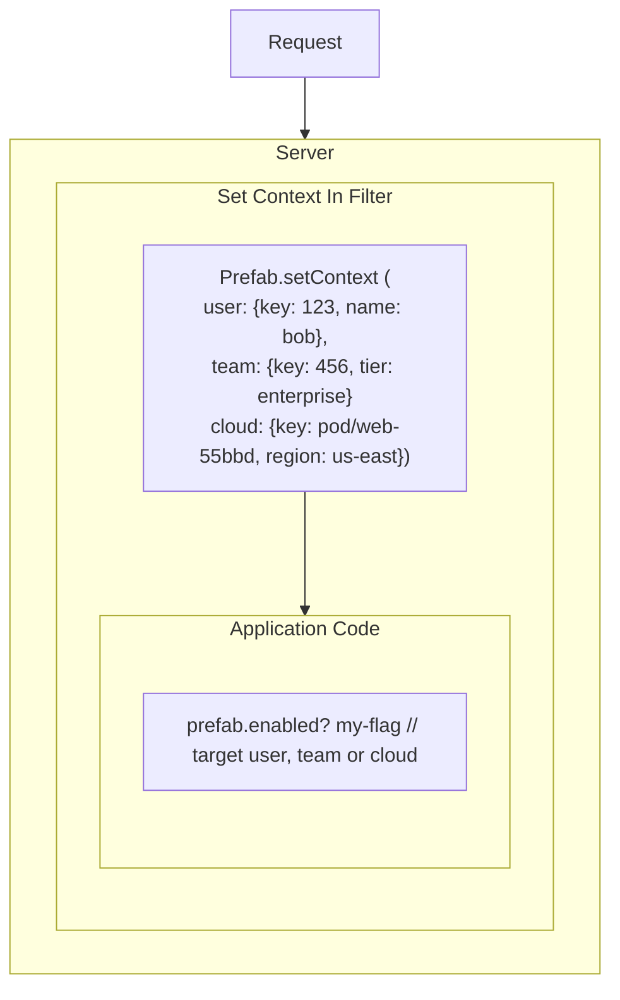

Feature Flags, Dynamic Logging and Config are most powerful when we can target specific users, teams or parts of our infrastructure.
Context is how we do that.



Setting context in a filter allows you to set this knowledge once and use it everywhere when you evaluate feature flags, configs, and [targeted log levels](/docs/explanations/features/targeted-log-levels) without having to pass your context data deeply around your app.

In a web app, the life-cycle of contexts are the life-cycle of the request. You set context at the beginning of the request and then it is cleared out when the request finishes.

For feature flags, context usage is optional but a useful ergonomic -- you can always pass in your context just-in-time to your FF evaluations.

For usage examples, see your relevant SDK client documentation.

## Global and scoped context

To avoid deeply passing around awareness of the current user, request, etc., Prefab allows you to set Context globally and also for a thread/request. The mechanisms for doing so will vary by language and framework.

When context is set, log levels and feature flags will be evaluated in that context. If you provide just-in-time context to your FF evaluations, it will be merged with the thread/request context and global context. More on merging below.

The most-specific context will always win. If you set the same key in your JIT context that is present in another context, it will clobber the global context and thread/request context for the duration of the evaluation.

<Tabs groupId="lang">
<TabItem value="ruby" label="Ruby">

We can use a block to specify the context for the duration of the block.

```ruby

Prefab.init(global_context: {application: {key: "my.corp.web"}})

context = { device: { key: "abcdef", mobile: mobile? } }

Prefab.with_context(context) do
  # ...
end
```

</TabItem>
<TabItem value="ror" label="Ruby on Rails">

We can set global context when initializing Prefab

```ruby
# in config/application.rb
Prefab.init(global_context: {application: {key: "my.corp.web"}})
```

We can use an `around_action` to set our context for the life-cycle of the request.

```ruby
# in app/controllers/application_controller.rb
class ApplicationController < ActionController::Base
  around_action :set_prefab_context

  def set_prefab_context
    Prefab.with_context(context) do
      yield
    end
  end

  def context
    {
      device: {
        key: "abcdef",
        mobile: mobile?
      }
      user: current_user&.to_context
      # ...
    }
  end
end
```

Learn more with the [Prefab + Rails example app](https://github.com/prefab-cloud/example-rails-app)

</TabItem>

<TabItem value="micronaut" label="Micronaut">

In your Prefab options, set your Prefab Context store to be your ServerRequestContextStore.

```java
options.setContextStore(new ServerRequestContextStore());
```

Next, we add a [filter](https://github.com/prefab-cloud/example-micronaut-app/blob/configure-prefab-context/src/main/java/com/example/prefab/PrefabContextFilter.java) to add a prefab context based on the currently "logged in" user.

```java
configClient.getContextStore()
      .addContext(PrefabContext.newBuilder("user")
          .put("key", user.key())
          .put("country", user.country())
          .put("email", user.email())
          .build()
      );
```

Learn more with the [Prefab + Micronaut example app](https://github.com/prefab-cloud/example-micronaut-app)

</TabItem>

<TabItem value="dropwizard" label="Dropwizard">

Use a `ContainerRequestFilter` to set the context for your request when the request begins

```java
public class PrefabContextAddingRequestFilter implements ContainerRequestFilter {
    private static final Logger LOGGER = LoggerFactory.getLogger(PrefabContextAddingRequestFilter.class);
    private final ConfigClient configClient;

    @Inject
    public PrefabContextAddingRequestFilter(ConfigClient configClient) {
        this.configClient = configClient;
    }

    @Override
    public void filter(ContainerRequestContext containerRequestContext) throws IOException {
        final SecurityContext securityContext =
                containerRequestContext.getSecurityContext();
        if (securityContext != null) {
            Principal principal = securityContext.getUserPrincipal();
            if (principal instanceof User) {
                User user = (User) principal;
                LOGGER.info("will add pf context for {}", user);
                configClient.getContextStore().addContext(PrefabContext.newBuilder("User")
                        .put("key", user.getKey())
                        .put("name", user.getName())
                        .build());
            }
        }
    }
}
```

Then we'll add another `ContainerResponseFilter` to clear the context when the request finishes.

```java
public class PrefabContexClearingResponseFilter implements ContainerResponseFilter {
    private static final Logger LOGGER = LoggerFactory.getLogger(PrefabContexClearingResponseFilter.class);
    private final ConfigClient configClient;

    @Inject
    PrefabContexClearingResponseFilter(ConfigClient configClient) {
        this.configClient = configClient;
    }

    @Override
    public void filter(ContainerRequestContext containerRequestContext, ContainerResponseContext containerResponseContext) throws IOException {
        configClient.getContextStore().clearContexts();
        LOGGER.info("Cleared context");
    }
}
```

Learn more with the [Prefab + Dropwizard example app](https://github.com/prefab-cloud/example-dropwizard-app)

</TabItem>

<TabItem value="javascript" label="JavaScript">

In JavaScript, there is only the global context. You can't specify a JIT context. Prefab fetches evaluated feature flags based on the context you provided.

```javascript
import { prefab, Context } from '@prefab-cloud/prefab-cloud-js'

const context = new Context({user: { email: 'test@example.com' }, device: { mobile: true } });

const options = { apiKey: '1234', context };

await prefab.init(options);

if (prefab.isEnabled('cool-feature') {
  // ...
}
```

</TabItem>

<TabItem value="react" label="React">

In React, there is only the global context. You can't specify a JIT context. Prefab fetches evaluated feature flags based on the context you provided.

```jsx
import { PrefabProvider } from '@prefab-cloud/prefab-cloud-react';

const WrappedApp = () => {
  const context = { user: { email: "jeffrey@example.com" }, subscription: { plan: "advanced" } };

  return (
    <PrefabProvider
      apiKey={'YOUR_API_KEY'}
      contextAttributes={context}
      <App />
    </PrefabProvider>
  );
}
```

</TabItem>

<TabItem value="python" label="Python">

In Python, there is only the global context. You can't specify a JIT context. Prefab fetches evaluated feature flags based on the context you provided.

```python
from prefab_cloud_python import Options, Client, Context

context = {
    "user": {
        "key": 123,
        "subscription_level": "pro",
        "email": "bob@example.com"
    },
    "team": {
        "key": 432,
    },
    "device": {
        "key": "abcdef",
        "mobile": False
    }
}

shared_context = Context(context)

prefab = Client(Options())

Context.set_current(shared_context)

prefab.enabled("my-first-feature-flag")
```

</TabItem>

</Tabs>

## Context keys

:::note
**`key` is special**

The key is the one special attribute of a context. It should be the unchanging, primary key of whatever your context is. For a user, that's likely the tracking ID set when you first saw them. For a team, it's probably the primary key of the table. For a Kubernetes pod, the pod id. Key is the handle Prefab if you want to add this context entity to a feature flag.

It's ok if there isn't a good key. If you add `{cloud: {region: us-east, availability-zone: us-east-1a}}`, you'll be able to target `cloud.region` or `cloud.availability-zone` with rules. If you add `cloud.key: "i-1234567890abcdef0"` you'll additionally be able to search for this context entity in context search tool.

If you provide a `name` attributes (as a sibling to `key`), it will be used in the Prefab UI to display the context entity as a "friendly" alternative to `key`. If you don't provide a `name`, Prefab will use the `key` as the display name.
:::

## Dot notation

When referencing fields from context, we use dot notation.

Given the context:

```ruby
{
  user: {
    key: "1234",
    email: "test@example.com",
  },

  device: {
    key: "abcd123e-a123-bcFG-d123",
    mobile: true,
  },
}
```

You can reference `user.key` and `device.mobile` in the property field in the UI.


## Advanced: Adding to and Merging Contexts

If you provide a context that conflicts with an existing context, your new context values will clobber any previous value.

Let's use this example as our initial context. It has two contexts: "request" and "subscription".

```json
{
  "request": {
    "mobile": true,
    "country": "US"
  },
  "subscription": {
    "key": "s_123",
    "allow_overages": false,
    "plan": "Pro"
  }
}
```

If we set the "request" context to `{ key: "f1e6461a", type: "iPhone" }` then we lose the `mobile` and `country` attributes of our "request" context. Our current context is now

```json
{
  "request": {
    "key": "f1e6461a",
    "device_type": "iPhone"
  },
  "subscription": {
    "key": "s_123",
    "allow_overages": false,
    "plan": "Pro"
  }
}
```

If we provide Just-In-Time (JIT) context to our flag evaluation call, then the JIT keys clobber the current context keys only for the duration of the evaluation.

```ruby
jit_context = {
  subscription: { allow_overages: true },
  user: { admin: true }
}

Prefab.enabled?("my.flag.name", jit_context)
```

That `enabled?` check uses this context

```json
{
  "request": {
    "key": "f1e6461a",
    "type": "iPhone"
  },
  "subscription": { "allow_overages": true },
  "user": { "admin": true }
}
```

But then the current context after that evaluation is still

```json
{
  "request": {
    "key": "f1e6461a",
    "type": "iPhone"
  },
  "subscription": {
    "key": "s_123",
    "allow_overages": false,
    "plan": "Pro"
  }
}
```

You can, of course, do your own merging before re-setting the context key.
