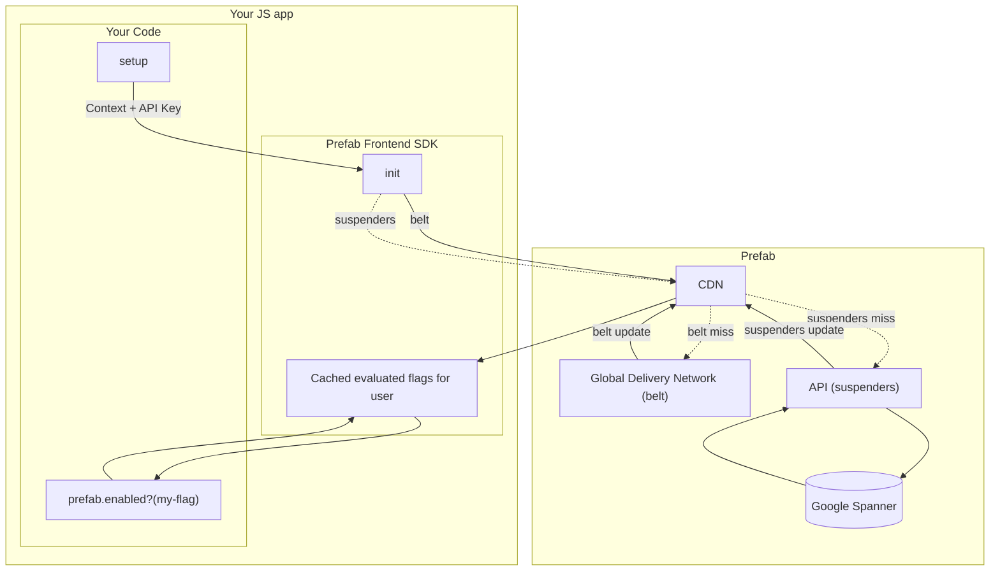

## Frontend Architecture

:::info

To prevent accidentally leaking sensitive config information, frontend SDKs do not receive Configs by default. You can enable frontend availability for any individual config using the "Send to frontend SDKs" checkbox in the Prefab UI.

:::

The frontend architecture has different goals and operating characteristics from the backend SDKs. The goals of the clients are:

1. Make lookups as fast as possible
2. Don't leak raw configuration data to the end user
3. Give clear and configurable behavior options if a connection cannot be made

With those goals in mind, the architecture is:



Usually, clients make a single request and receive the values of all evaluated Feature Flags for a given context. For reliability, the client uses a belt-and-suspenders approach, so if the "belt" request isn't timely, we'll fall back to the "suspenders" endpoint.

If you change a context’s attributes and re-initialize the client, we'll re-fetch the flags for that context.

Note that **evaluation happens server side**. This prevents your potentially sensitive rule data from leaking to an untrusted browser. For example, if you
have a `special-feature` released to a list of customer IDs, the browser will only see `special-feature: false`, not the list of your special customer IDs.

The client will be returned a list that is basically:

```json
{
  "feature.exp12-big-button": "control",
  "feature.exp14-button-class": "very-blue",
  "feature.risky-business": true
}
```

See [backend SDKs](/docs/explanations/concepts/backend-sdks.md) to compare this approach to in-memory rule evaluation.

## Client Side Reliability

The "belt" is a globally distributed service that serves evaluations near your users to keep latency low. The "suspenders" is a global API that serves evaluations if the belt is down.

Each end-user that needs flags evaluated is a different request to Prefab. So what happens if Prefab's belt and suspenders are both down?

First, the good news. All **active** users will be unaffected because they will have cached values in the CDN.
If you make a change to your feature flags, it won't be reflected, but logged-in users will be served the most
recent evaluation of the flags.

The less good news is that if a [context](/docs/explanations/concepts/context) that has not been seen before asks for evaluation, it will not have been cached. After a configurable timeout, the client will fall back to default values.
Without values, your `isEnabled` checks will return `false`.

Frontend config will return `undefined`, and you can use the pattern `prefab.get("thing") ?? "this-is-my-default"` to set a default.

The default timeout is `10` seconds, but you can set this in client initialization.

You can run your own JS/React evaluation endpoint using the prefab CLI's [download](/docs/tools/cli#download) and [serve](/docs/tools/cli#serve) commands ([read more in our offline mode documentation][offline]). We also support [zero-ms feature flags and configs][0ms] in some Backend SDKs. If you have questions about this or our reliability roadmap, contact us, and we'll share what we're working on.

[offline]: /docs/how-tos/offline-mode.md
[0ms]: /docs/explanations/concepts/zero-ms-frontend-feature-flags
