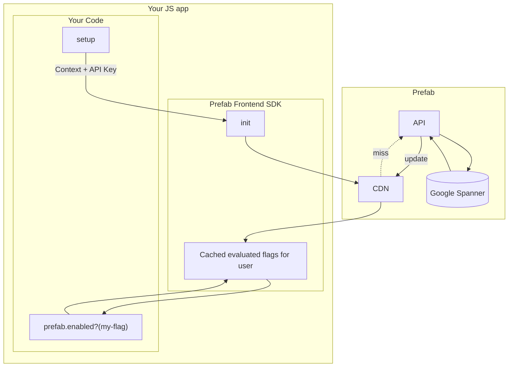

## Frontend Architecture

:::info

Frontend SDKs do not receive Configs by default, but you can enable frontend availability for any individual config. This is to prevent accidentally leaking sensitive config information.

:::

The frontend architecture has different goals and different operating characteristics from the backend SDKs. The goals of the clients are:

1. Make lookups as fast as possible
2. Don't leak raw configuration data to the end user
3. Give clear and configurable behavior options if a connection cannot be made

With those goals in mind, the architecture is:



Clients will make a single request and receive the values of all evaluated Feature Flags for a given context.

Multiple requests only happen if you change the attributes of a context and re-initialize the client.

Note that **evaluation happens server side**. This prevents your potentially sensitive rule data from leaking to an untrusted browser. For example if you
have a `special-feature` released to a list of customer IDs, the browser will only see `special-feature: false` not the list of your special customer IDs.

The client will be returned a list that is basically:

```json
{
  "feature.exp12-big-button": "control",
  "feature.exp14-button-class": "very-blue",
  "feature.risky-business": true
}
```

See [backend SDKs](/docs/explanations/concepts/backend-sdks.md) to compare this approach to in-memory rule evaluation.

## Client Side Reliability

Each end-user that needs flags evaluated is a different request to Prefab. So what happens if Prefab goes down?

First the good news. All **active** users will be unaffected, because they will have cached values in the CDN.
If you make a change to your feature flags, it won't be reflected, but logged-in users will be served the most 
recent evaluation of the flags.

The less good news. If a [context](/docs/explanations/concepts/context) that has not been seen before asks for evaluation, that will not have been cached. After a configurable timeout the client will fallback to default values. 
Without values, your `isEnabled` checks will return `false`. 

Frontend config will return `undefined` and you can use the pattern `prefab.get("thing") ?? "this-is-my-default"` to set a default.

The default timeout is `10 sec`, but you can set this in client initialization.

To improve resiliency, running a proxy may be of interest to you. If you have questions about this or our reliability roadmap, contact us and we'll share what we're working on. 
