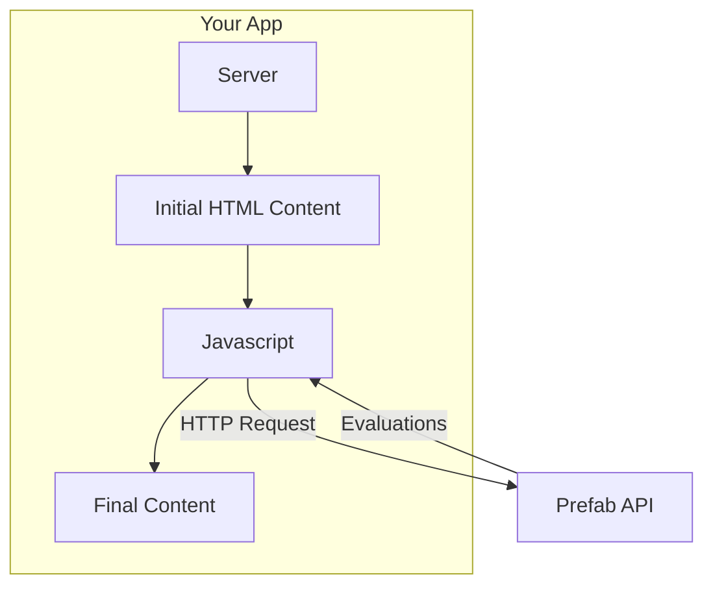
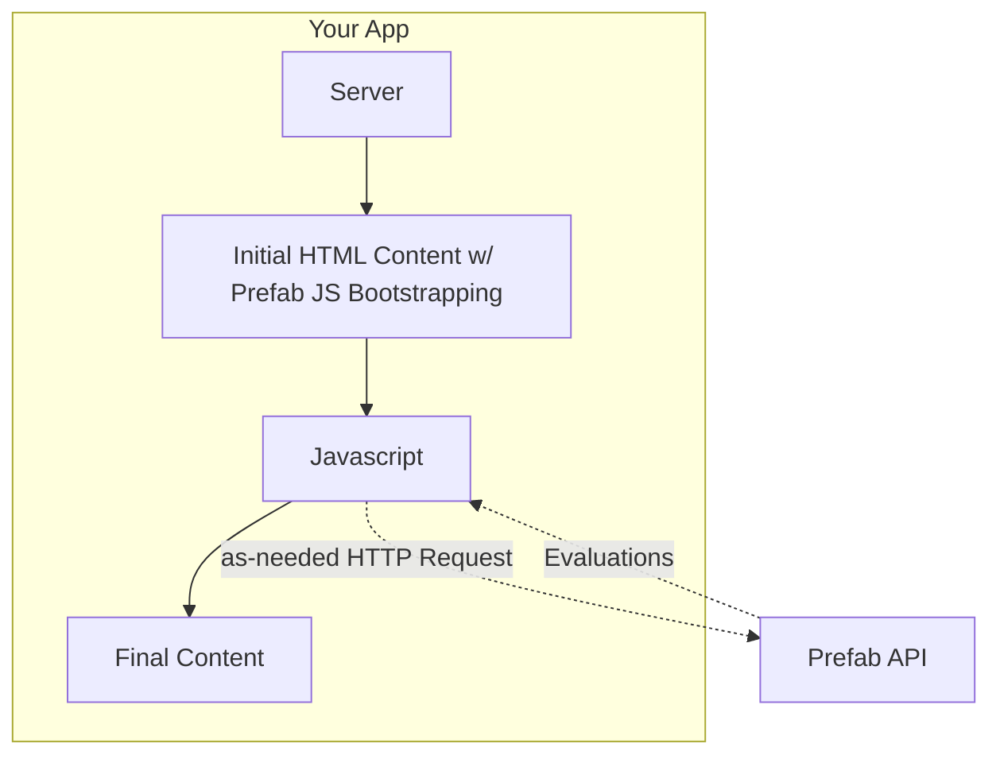
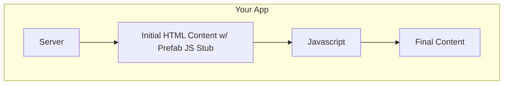

Prefab believes that frontend performance is critical to a great user experience. We've [designed our frontend SDKs][arch] to be as fast as possible to ensure your users have a great experience.

But no matter how fast our global delivery system is, it still requires an HTTP request to get the feature flag and config evaluations from our server, and every HTTP request is a performance hit where the user is left waiting. We want to help you avoid that.

Starting with our Ruby client, we're introducing zero-ms feature flags. This feature allows you to send your feature flag evaluations from your backend to your frontend, saving your users an HTTP request and enabling you to run offline without any changes to your frontend code.

This comes in two flavors: Stub mode and Bootstrapping mode.

:::note
Zero-ms feature flags are currently available in our Ruby client. We're working on adding this feature to our other clients. If you’re interested in this feature for another client, contact us via the chat widget in the bottom corner of the page.
:::

## Without Zero-Millisecond Feature flags

To understand the value of zero-ms feature flags, let's look at the behavior of HTTP-based frontend feature flag evaluations.

This is a fine design, and we've taken [great pains][arch] to make it as fast as possible. But the user has to wait for the HTTP request to complete before the final content is shown. You can either show the original content or a spinner while the user waits for the response. This performance hit can lead to a FOOC (flash of original content).



## Bootstrap Mode

Choose bootstrapping mode if you're already using one of our frontend SDKs and want to keep the reactivity of our SDKs when context changes due to frontend context enrichment.

The user doesn't have to wait for an HTTP request to complete. The content is shown immediately. The feature flags and config values are bootstrapped into the page and evaluated server-side. The developer gets the full power of the JavaScript/React clients, and the client can still update the values as needed if the context changes.



<Tabs groupId="lang">
<TabItem value="ruby" label="Ruby">

Just invoke the `bootstrap_javascript` method in your view with the current user's context:

```erb
<%== Prefab.bootstrap_javascript(context) %>
```

</TabItem>
</Tabs>

## Stub Mode

Choose stub mode if you don't want to use our [JavaScript][js] or [React][react] SDKs. Stub mode gives you a global `window.prefab` object to call `get` and `isEnabled` on the client side.

This will give you feature flags and config values for your current context. You can optionally provide a callback to record experiment exposures or other metrics. No HTTP request or SDK is needed!



<Tabs groupId="lang">
<TabItem value="ruby" label="Ruby">

Just invoke the `generate_javascript_stub` method in your view with the current user's context:

```erb
<%= Prefab.generate_javascript_stub(context, callback = nil) %>
```

</TabItem>
</Tabs>

[arch]: ../concepts/frontend-sdks
[js]: ../../sdks/javascript
[react]: ../../sdks/react
