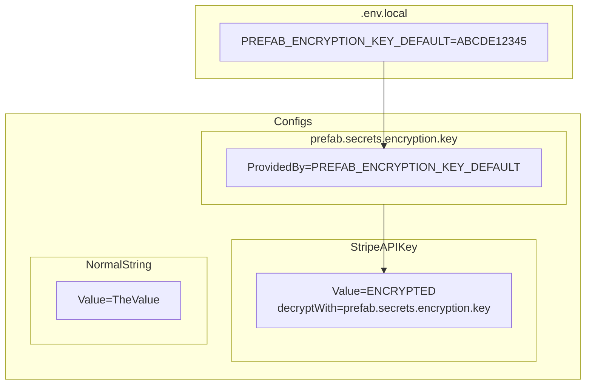
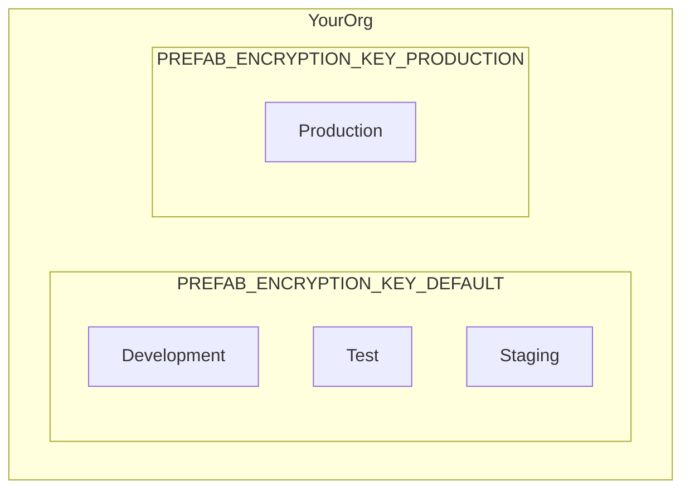

Prefab has zero-knowledge support for sharing your secrets between developers and between your different applications.


## How Does It Work

Prefab secret management uses standard Prefab dynamic configuration to store and share your secrets between your applications.

In particular, it uses two special types of configuration attributes: `decryptWith` and `provided`. Let's see how these work together.

### Step 1: Create an Encryption Key

Prefab allows you to declare that a configuration value will be provided by an environment variable. Prefab will store a config that is kind of an empty vessel. It is a pointer that says "find my value from this ENV VAR".

We want Prefab to have zero knowledge of your encryption key, so we'll use these provided values so you don't have to tell us the encryption key.

#### Create the empty vessel

```bash
prefab create prefab.secrets.encryption.key --env-var=PREFAB_ENCRYPTION_KEY_DEFAULT --type string --confidential
```

This creates:
1. A config called `prefab.secrets.encryption.key`
2. That will resolve to `PREFAB_ENCRYPTION_KEY_DEFAULT`
3. That won't report/print the value because it's `--confidential`

#### Put something in the vessel locally

We'll generate a secure series of random bytes to be our encryption key.
```bash
> prefab generate-new-hex-key
17f65155e45a42777d89091e40cddc5541ac4851c44134f86db7a408a7fea5a8
```

Now we put this into our environment using something like a `.env.local` file.
```bash
#.env.local
PREFAB_ENCRYPTION_KEY_DEFAULT=17f65155e45a42777d89091e40cddc5541ac4851c44134f86db7a408a7fea5a8
```

If we run our application now and call `Prefab.get("prefab.secrets.encryption.key")` we'll get `17f65155e45a42777d89091e40cddc5541ac4851c44134f86db7a408a7fea5a8`.


## Step 2: Encrypt Something

#### Encrypt a value

```bash
prefab create my.api.key --type string --value="sample api key" --secret
```

This will:
1. Assume that we are using the value of `prefab.secrets.encryption.key` to encrypt.
2. Pull the key from our environment.
3. Use that key to encrypt `sample api key`
4. Push and encrypted blob to Prefab under the key `my.api.key`


Here's a pictoral representation of what we've done so far



## Step 3: Using the Secret

Locally, we're all set 
To use the secret, we need to get `PREFAB_ENCRYPTION_KEY_DEFAULT=17f65155e45a42777d89091e40cddc5541ac4851c44134f86db7a408a7fea5a8`
set in our 

Secrets


Empty Vessel


To start with secrets, we are going to create 2 encryption keys.

image of dev/staging/test under DEFAULT.

## Separate Keys For Different Environments

It's very likely you'll like a different key for production.

#### Generate a second secret
```bash
> prefab generate-new-hex-key
17f65155e45a42777d89091e40cddc5541ac4851c44134f86db7a408a7fea5a8
```

#### Put that secret into a separate env var

Why use a second env var? You aren't required to, but it can be easier to have them use different names so they don't collide locally. 
You're going to need both of them available so that you can encrypt values from the CLI for both development and production.

```bash
#.env.local
PREFAB_ENCRYPTION_KEY_DEFAULT=17f65155e45a42777d89091e40cddc5541ac4851c44134f86db7a408a7fea5a8
PREFAB_ENCRYPTION_KEY_PRODUCTION=994899132443777d89091e40cddc5541abdeff123830488a7fea173b3b1b2b38
```

#### Update the prefab.secrets.encryption.key to look for the other ENV var in production
```bash
$ prefab change-default --confidential
? Which item would you like to change the default for? prefab.secrets.encryption.key
? Which environment would you like to change the default for? Production
Default value: PREFAB_ENCRYPTION_KEY_PRODUCTION
Confirm: change the default for prefab.secrets.encryption.key in Production to `PREFAB_ENCRYPTION_KEY_PRODUCTION`? yes/no: yes
✔ Successfully changed default to `PREFAB_ENCRYPTION_KEY_PRODUCTION` (confidential)
```

This is now the mapping of environment to ENV Var. 



#### Set a Secret in Production

```bash
$ prefab change-default
? Which item would you like to change the default for? my.api.key
? Which environment would you like to change the default for? Production
Default value: sk_live_123
Confirm: change the default for my.new.string in Production to `sk_live_123`? yes/no: yes
✔ Successfully changed default to `sk_live_123`
```

Note: You can use as many encryption keys as you want. You could have 1 per env or multiple per env to have smaller trust circles.


Valid combinations


## How should I get the actual ENCryption keys passed around.

In order to share the `PREFAB_ENCRYPTION_KEY_DEFAULT` with developers, you can use a password manager such as 1Password.
Or we suggest using [1ty.me](https://1ty.me/) [onetimesecret](https://onetimesecret.com/) or [password.link](https://password.link/).

This will be the only secret you ever need to share amongst your developers going forward. 

## How do I rotate


## How do secrets work in  CI?


